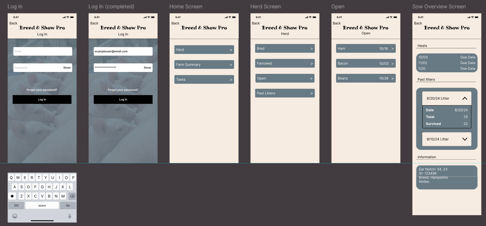

# Breed Show & Pro: Breeder Side Project Specification

**Version:** 1.0  
**Last Updated:** March 12, 2026

---

## 1. Project Description

Breed Show & Pro is a comprehensive web application designed to serve both breeders and show participants in the livestock management industry. This specification document focuses on the **Breeder Side** of the application, inspired by GESDATE breeding management systems.

The Breeder Side is a full-stack web application that enables pig breeders to efficiently manage their breeding operations through:

- **Herd Management:** Organize and track pigs by breeding status (Open, Bred, Farrowed, Sires)
- **Reproductive Cycle Tracking:** Monitor heat cycles, breeding dates, and pregnancy confirmations
- **Farrowing Management:** Record birth events, litter statistics, and survival rates
- **Automated Date Calculations:** Calculate critical breeding milestones (confirmation dates, farrowing dates, piglet maturity)
- **Task Management:** Create, assign, and track farm-related tasks with due dates
- **Lineage Tracking:** Maintain detailed genealogical records with sire and dam relationships
- **Upcoming dates Dashboard:** Get at-a-glance insights into upcoming events and required actions

The application addresses the complex scheduling and record-keeping needs of pig breeders, replacing manual spreadsheets and paper records with an intuitive digital platform optimized for both desktop and mobile use.

---

## 2. Team Members

Sara Burbank
Caitlyn Caldwell
Jenna McHargue

---

## 3. Technologies

### Frontend

- **Astro** - Static site generation and page routing
- **Svelte 5** - Interactive UI components and client-side interactivity (islands architecture)
- **JavaScript/TypeScript** - Primary language for frontend logic
- **CSS** - Custom styling (no Tailwind CSS per project constraints)

### Backend

- **Node.js** - JavaScript runtime environment
- **Express** - Web application framework for API routes
- **MongoDB Native Driver** - Database operations (no Mongoose per project constraints)

### Development Tools

- **pnpm** - Package manager (monorepo workspace)
- **ESLint** - Code linting and quality
- **Git** - Version control

### Hosting & Deployment (Planned)

- **Frontend+Backend:** Render
- **Database:** MongoDB Atlas (cloud-hosted)

---

## 4. Team Management & Communication Strategy

### Communication Tools

- **Primary Communication:** Discord - Daily updates, questions, and quick coordination
- **Code Collaboration:** GitHub - Pull requests, code reviews, issue tracking
- **Documentation:** GitHub project README files

### Workflow

- **Version Control:** Git with feature branch workflow
  - `main` branch - Production-ready code
  - Feature branches - Individual feature development (`feature/pig-profile`, `feature/breeding-calculator`, etc.)
- **Code Reviews:** All code must be reviewed by at least one team member before merging to develop
- **Meeting Schedule:** 4 days weekly in class, scheduled meetings outside of class as needed and discussed review progress and plan next steps
- **Task Management:** Trello board

---

## 5. Core Features

The following features are essential for the Minimum Viable Product (MVP) and must be implemented:

- Registration and login
- Messaging between breeder and exhibitors
- Create records for sows(open, bred, farrowing) and sires
- Filter and sort pigs by multiple criteria
- Quick status updates from list view
- Litter history with statistics (born, survived, weaned)
- Automatically calculate pregnancy, farrowing, and 6 month date
- Upcoming dates lists upcoming dates for farrowing, heat, confirm, and tasks
- Task Management List

---

## 6. Additional Features (Future Enhancements)

These features are planned for post-MVP releases:

### Phase 2 (Short-term Enhancements)

- **Messaging System:** Internal notifications or communication between breeders
- **Weight Tracking:** Monitor pig weight over time with growth charts
- **Health Records:** Track vaccinations, vet visits, medications, and treatments
- **Enhanced Genetics:** Pedigree tree views, inbreeding coefficient calculations
- **Export/Reports:** Generate PDF reports for breeding records, herd summaries, litter statistics

### Phase 3 (Long-term Vision)

- **Multi-User Support:** User authentication, multiple farms, role-based permissions
- **Mobile Apps:** Native iOS/Android apps with offline support
- **Marketplace:** List pigs for sale, connect buyers with breeders
- **Calendar Integration:** Sync breeding/farrowing dates with Google Calendar or iCal
- **Automated Reminders:** Email/SMS notifications for upcoming tasks and events
- **Customer Tracking:** Create Customers and track who buys what pigs

---

## 7. Wireframe & Mockups

### Dashboard Wireframe



```
+----------------------------------------------------------+
|  BREED SHOW & PRO - DASHBOARD              [User Menu]   |
+----------------------------------------------------------+
|                                                           |
|  [Herd Widget]          [Upcoming dates Widget]            |
|  +-----------------+    +---------------------------+    |
|  | Total: 45       |    | Next to Farrow:           |    |
|  | Bred: 12        |    |  • Sow #423 - 3 days     |    |
|  | Farrowed: 8     |    |  • Sow #401 - 5 days     |    |
|  | Open: 20        |    |                           |    |
|  | Sires: 5        |    | Sows to Confirm: 4        |    |
|  +-----------------+    | Tasks Due: 7              |    |
|                         +---------------------------+    |
|                                                           |
|  [Tasks Widget]                                          |
|  +------------------------------------------------+      |
|  | □ Check Sow #423 (Due: Today)                 |      |
|  | □ Order feed (Due: Tomorrow)                   |      |
|  | □ Schedule vet visit                           |      |
|  | [+ Add Task]                        [View All] |      |
|  +------------------------------------------------+      |
+----------------------------------------------------------+
```

### Herd List View Wireframe

```
+----------------------------------------------------------+
|  HERD MANAGEMENT                                          |
+----------------------------------------------------------+
| [Bred] [Farrowed] [Open] [Sires] [Past Litters]         |
+----------------------------------------------------------+
| Filter: [All Breeds ▼]  Sort: [Expected Farrow ▼]       |
+----------------------------------------------------------+
| Ear Notch | Name    | Breed    | Bred Date  | Due Date  |
|-----------|---------|----------|------------|-----------|
| #423      | Bella   | Yorkshire| 01/15/2026 | 05/09/2026|
| #401      | Daisy   | Duroc    | 01/20/2026 | 05/14/2026|
| #387      | Rosie   | Hampshire| 01/25/2026 | 05/19/2026|
+----------------------------------------------------------+
```

### Individual Pig Profile Wireframe

```
+----------------------------------------------------------+
|  [< Back to Herd]                           [Edit] [⋮]   |
+----------------------------------------------------------+
|  [Photo Gallery]                                          |
|  +----------------+  +----------------+  +-------------+  |
|  |   [Primary]    |  |   [Photo 2]    |  | [Photo 3]  |  |
|  +----------------+  +----------------+  +-------------+  |
|                                                           |
|  BASIC INFORMATION                                        |
|  Ear Notch: #423          Name: Bella                     |
|  Breed: Yorkshire         Sex: Female                     |
|  DOB: 03/15/2024          Status: Bred                    |
|  Sire: Boar #101          Dam: Sow #356                   |
|                                                           |
|  REPRODUCTIVE HISTORY                                     |
|  Heat Dates: 12/20/2025, 01/10/2026                      |
|  Current Breeding: 01/15/2026 (Sire: Boar #101)          |
|  Expected Farrowing: 05/09/2026 (33 days)                |
|                                                           |
|  LITTER HISTORY                                           |
|  Litter #1 - 08/10/2025: 11 born, 10 survived            |
|  Litter #2 - 02/15/2025: 12 born, 11 survived            |
|                                                           |
|  NOTES                                                    |
|  [Text area with notes about the pig...]                 |
|                                                           |
|  [Record Farrowing] [Add Photo] [Add Note]               |
+----------------------------------------------------------+
```

### Breeding Calculator Wireframe

```
+----------------------------------------------------------+
|  BREEDING CALCULATOR                                      |
+----------------------------------------------------------+
|                                                           |
|  Breeding Date: [01/15/2026] [Calendar Icon]             |
|                                                           |
|  CALCULATED DATES                                         |
|  ┌────────────────────────────────────────────────┐      |
|  │  Breed Date                 01/15/2026          │      |
|  │      ↓ (22 days)                                │      |
|  │  Confirm Pregnancy          02/06/2026          │      |
|  │      ↓ (92 days)                                │      |
|  │  Expected Farrowing         05/09/2026          │      |
|  │      ↓ (183 days)                               │      |
|  │  Piglets 6 Months Old       11/08/2026          │      |
|  └────────────────────────────────────────────────┘      |
|                                                           |
|  [Create Breeding Record for Sow ▼]                      |
+----------------------------------------------------------+
```

### Tasks Page Wireframe

```
+----------------------------------------------------------+
|  TASKS                                      [+ New Task]  |
+----------------------------------------------------------+
| Filter: [ ] Show Completed   Sort: [Due Date ▼]          |
+----------------------------------------------------------+
| Status | Task Name          | Due Date   | Related To    |
|--------|-------------------|------------|----------------|
| ☑      | Check Sow #423    | Today      | Sow #423      |
| □      | Order feed        | Tomorrow   | -             |
| □      | Schedule vet      | 03/15/2026 | -             |
| ⚠ □    | Confirm Sow #401  | OVERDUE    | Sow #401      |
+----------------------------------------------------------+
```

---

## 8. Database Schema

### Collections Overview

- `pigs` - Individual pig records
- `litters` - Farrowing/litter records
- `tasks` - Farm task records
- `users` - User accounts

### Pigs Collection

```javascript
{
  _id: ObjectId,
  earNotch: String,          // Unique identifier (indexed)
  name: String,              // Friendly name
  breed: String,             // Breed name
  sex: String,               // "male" | "female"
  dateOfBirth: Date,
  sireId: ObjectId,          // Reference to father (nullable)
  status: String,            // "open" | "bred" | "farrowed" | "sire" | "archived"

  // Reproductive tracking (for females)
  heatDates: [
    {
      date: Date,
      notes: String
    }
  ],

  lastFarrowedDate: Date,    // Most recent farrowing (nullable)

  // Current breeding info (for bred sows)
  currentBreeding: {
    bredDate: Date,
    sireId: ObjectId,
    confirmedDate: Date,     // Date pregnancy was confirmed (nullable)
    expectedFarrowingDate: Date
  },


  // Metadata
  createdAt: Date,
  updatedAt: Date,
  archivedAt: Date           // Null if not archived
}
```

### Litters Collection

```javascript
{
  _id: ObjectId,
  litterNumber: Number,      // Sequential number for farm
  damId: ObjectId,           // Mother (required, indexed)
  sireId: ObjectId,          // Father (required, indexed)
  bredDate: Date,
  farrowingDate: Date,       // Birth date (indexed)

  // Litter statistics
  bornAlive: Number,
  stillborn: Number,
  survivedToWeaning: Number,

  weaningDate: Date,         // Date piglets were weaned (nullable)

  // Notes
  notes: String,

  // Metadata
  createdAt: Date,
  updatedAt: Date
}
```

### Tasks Collection

```javascript
{
  _id: ObjectId,
  name: String,              // Task title (required)
  notes: String,             // Optional details
  dueDate: Date,             // Optional due date (indexed)
  status: String,           // "incomplete" | "complete"

  // Optional associations
  relatedPigId: ObjectId,    // Link to specific pig (nullable)
  relatedLitterId: ObjectId, // Link to specific litter (nullable)

  // Completion tracking
  completedAt: Date,         // Null if incomplete

  // Metadata
  createdAt: Date,
  updatedAt: Date
}
```

### Users Collection (Phase 2)

```javascript
{
  _id: ObjectId,
  email: String,             // Unique, indexed
  passwordHash: String,
  farmName: String,
  firstName: String,
  lastName: String,
  createdAt: Date,
  updatedAt: Date,
  lastLoginAt: Date
}
```

---

## 9. API Endpoints

### Herd Endpoint

```
GET    /api/stats/herd-summary
GET    /api/stats/herd-summary/bred
GET    /api/stats/herd-summary/farrowed
GET    /api/stats/herd-summary/open

```

### Pigs Endpoints

```
GET    /api/pigs
POST   /api/pigs

GET    /api/pigs/:id
PUT    /api/pigs/:id
DELETE /api/pigs/:id

POST   /api/pigs/:id/breeding

POST   /api/pigs/:id/farrowing
POST   /api/pigs/:id/weaning
POST   /api/pigs/:id/heat-date

PATCH  /api/pigs/:id/archive
```

### Litters Endpoints

```
GET    /api/litters
POST   /api/litters

GET    /api/litters/:id
PUT    /api/litters/:id
DELETE /api/litters/:id
```

### Tasks Endpoints

```
GET    /api/tasks
POST   /api/tasks

GET    /api/tasks/:id
PUT    /api/tasks/:id
PATCH  /api/tasks/:id/complete
DELETE /api/tasks/:id
```

### Breeding Calculator Endpoint

```
POST   /api/breeding-calculator
```

### Upcoming dates Endpoints

```
GET    /api/upcoming-dates
```

---
